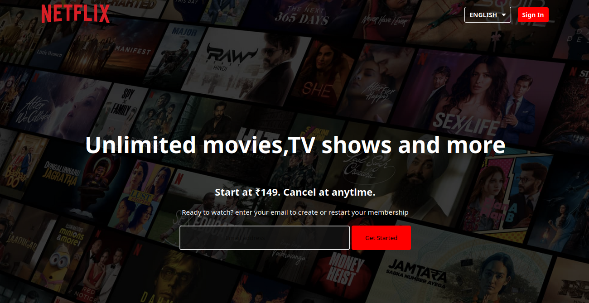

# Netflix

  <b>Overview</b> 
This is a simple Netflix clone built using HTML and CSS. The project mimics the design and layout of the Netflix homepage, featuring movie banners, categories, and a sleek, dark theme. The purpose of this project is to demonstrate proficiency in creating responsive web layouts using HTML for structure and CSS for styling.

  <b>Features</b>
     
  <ul>
    <li>Responsive Layout: The project is designed to be responsive, adapting to both mobile and desktop devices.</li>
    <li>Movie Sections: Different sections showcasing popular categories like "Trending Now," "Top Rated," and "Originals."</li>
    <li>Hover Effects: Movies have hover effects that display more information or a play button, similar to Netflix's interactive UI.</li>
    <li>Dark Theme: The design features a dark theme background to emulate Netflix's aesthetic.</li>
  </ul>

  <b>Technologies Used</b>
  <ul>
    <li>HTML5: Used to structure the content, including the layout for movie categories and sections.</li>
    <li>CSS3: Used to style the page, apply hover effects, and ensure a responsive layout.</li>
    <li>Flexbox: A CSS layout technique used for arranging the movie posters in a row and making them responsive.</li>
    <li>CSS Transitions: Used for smooth hover effects on the movie posters.</li>
  </ul>

